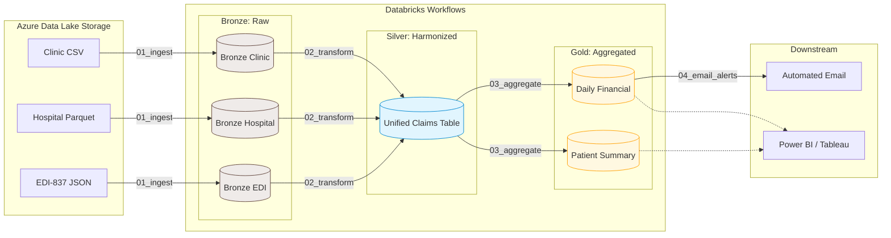

# Healthcare Claims Data Lakehouse

## Project Objective
This project implements an end-to-end Medallion Architecture (Bronze, Silver, Gold) using Azure Databricks and PySpark. The pipeline is designed to ingest disparate healthcare claims data (Clinic, Hospital, and EDI-837 formats), harmonize them into a unified schema, and aggregate the data into business-ready reporting tables. The workflow concludes with an automated email alert system to deliver daily financial metrics to stakeholders.

## Technology Stack
* **Compute & Orchestration:** Azure Databricks, Databricks Workflows (Jobs)
* **Storage Framework:** Azure Data Lake Storage (ADLS Gen2), Delta Lake
* **Data Processing:** Python, PySpark, Spark SQL
* **Security:** Databricks Secret Scopes
* **Version Control:** Git, GitHub (via Databricks Git Folders)

## Architecture Overview



## Pipeline Stages (What We Have Built)

### 1. Bronze Layer (Raw Ingestion)
* **Objective:** Extract raw, unstructured, and semi-structured data from the Azure landing zone and persist it as Delta tables.
* **Mechanism:** Utilizes Databricks Auto Loader (`cloudFiles`) for scalable, incremental data ingestion with built-in schema evolution support.
* **Sources:** Clinic Claims (CSV), Hospital Claims (Parquet), EDI-837 Claims (Nested JSON).
* **Script:** `01_ingest_bronze.py`

### 2. Silver Layer (Harmonization & Deduplication)
* **Objective:** Cleanse, flatten, and unify the disparate data sources into a single, query-ready table.
* **Transformations:**
  * Flattens deeply nested JSON structures using PySpark dot-notation.
  * Standardizes diverse column names (e.g., mapping `hospital_claim_id` and `claim_id` to a single `unified_claim_id`).
  * Enforces proper data type casting (String to DateType and DoubleType).
  * Executes idempotent Upserts using the Delta `MERGE` command to prevent duplicate records if the pipeline is rerun.
* **Script:** `02_transform_silver.py`

### 3. Gold Layer (Business Aggregations)
* **Objective:** Generate analytics-ready dimensional and fact tables for downstream Business Intelligence (BI) consumption.
* **Outputs:**
  * **Daily Financial Summary:** Aggregates total claim volumes, total revenue, and maximum claim amounts grouped by source system and service date.
  * **Patient Lifetime Summary:** Calculates total lifetime visits, lifetime spend, and retention dates (first/last visit) per patient.
* **Script:** `03_aggregate_gold.py`

### 4. Automated Alerting & Data Activation
* **Objective:** Proactively push critical data insights to stakeholders immediately upon successful pipeline execution.
* **Mechanism:** Reads the refreshed Gold layer daily financial metrics, formats them into an HTML table, and dispatches an automated email via Gmail SMTP. Credentials are authenticated securely via Databricks Secrets to ensure no plain-text passwords exist in the codebase.
* **Script:** `04_email_alerts.py`

## Orchestration & Deployment
The entire pipeline is orchestrated via **Databricks Workflows**. The scripts are chained sequentially into a single automated Job establishing a strict dependency graph (`01` -> `02` -> `03` -> `04`). 

If a downstream task fails (for example, if a corrupted file crashes the Bronze ingestion step), the pipeline halts immediately. This architectural design ensures that bad data never propagates into the Gold reporting tables.

## How to Run This Project
1. **Clone Repository:** Connect Databricks to your GitHub via **Git Folders** and clone this repository into your workspace.
2. **Configure Storage:** Ensure your Azure Storage configurations are passed via the `argparse` parameters or set as defaults in the PySpark scripts.
3. **Configure Secrets:** Set up your SMTP credentials securely in the Databricks CLI:
   ```bash
   databricks secrets create-scope smtp_creds
   databricks secrets put-secret smtp_creds email_address
   databricks secrets put-secret smtp_creds app_password
   ```
4. **Execute:** Trigger the workflow manually via the Databricks Jobs UI or set it to run on a daily schedule.